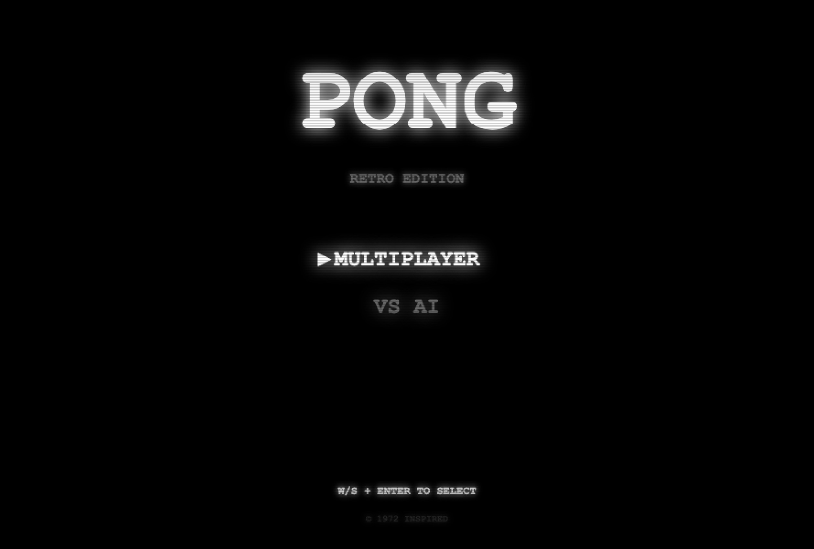
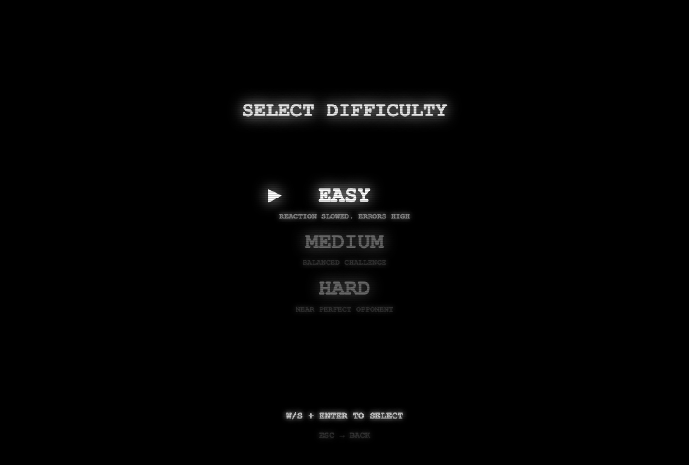
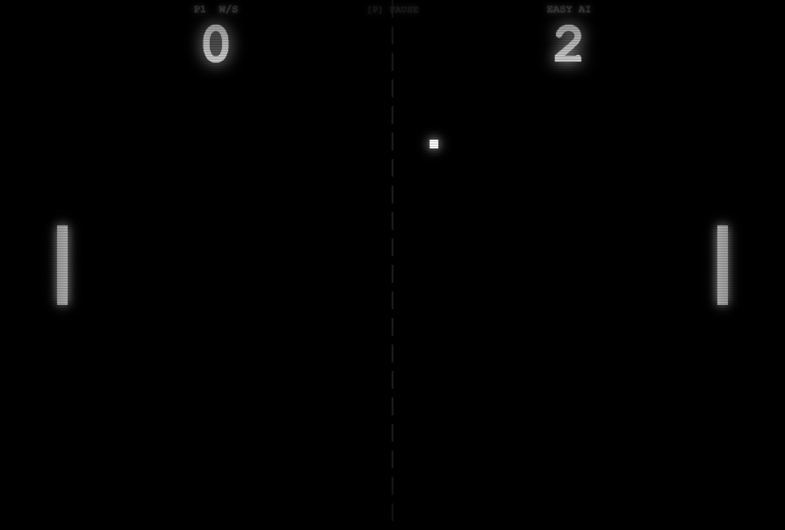

# Retro Pong

A browser-based reimagining of the 1972 arcade classic. Retro CRT aesthetic — scanlines, screen glow, and 8-bit sound — with modern features like three AI difficulty levels and local two-player support. No installation or dependencies required.

## Screenshots

### Home Screen



### AI Level Selection



### Sample Gameplay



---

## Play

**Option 1 — Open directly in your browser**

1. Download or clone this repository
2. Open `index.html` in any modern browser

**Option 2 — Clone via Git**

```bash
git clone https://github.com/tymastrangelo/retro-pong.git
cd retro-pong
open index.html
```

---

## Modes

| Mode | Description |
|---|---|
| Multiplayer | Two players on the same keyboard |
| VS AI — Easy | Slow reactions, frequent misses |
| VS AI — Medium | Balanced challenge |
| VS AI — Hard | Near-perfect opponent |

First to **7 points** wins.

---

## Controls

| Action | Player 1 | Player 2 |
|---|---|---|
| Move Up | `W` | `↑` |
| Move Down | `S` | `↓` |
| Pause | `P` or `Esc` | — |
| Confirm / Restart | `Enter` | — |

---

## Built With

- HTML5 Canvas
- Vanilla JavaScript
- Web Audio API (for retro sound effects)
